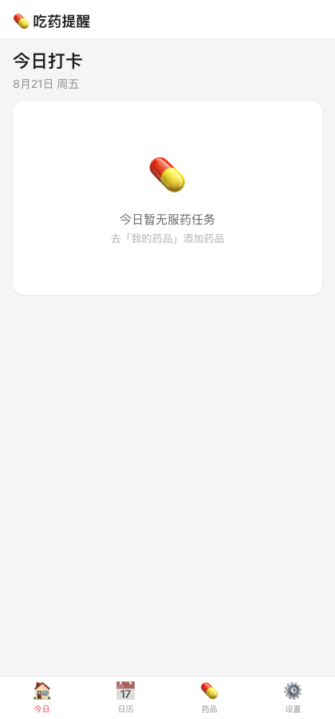
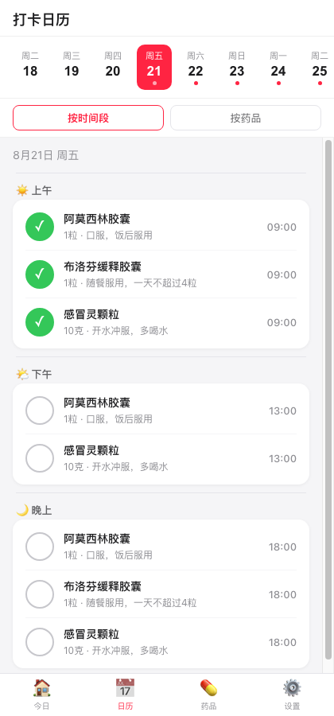
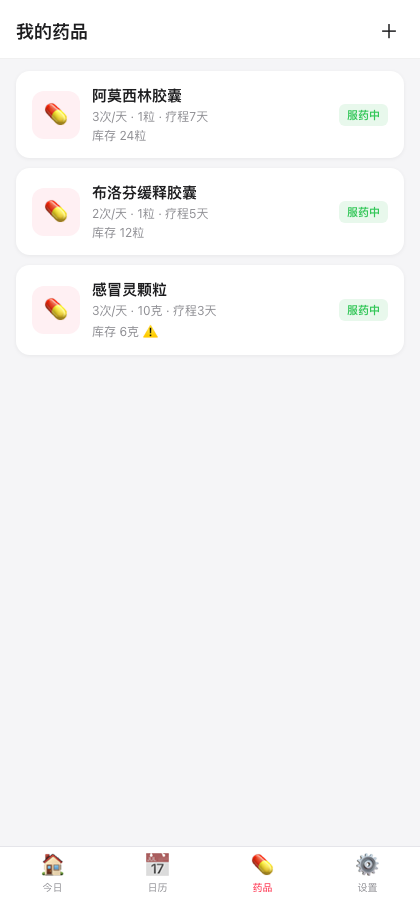
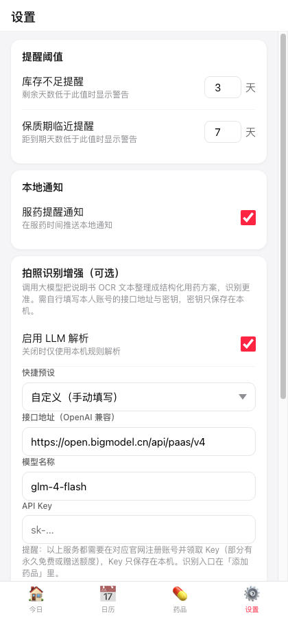

<div align="center">

# 💊 吃药提醒 Med Reminder

**一款离线优先的用药提醒 PWA，可打包为 Android APK。内置中文 OCR，拍照说明书秒变结构化服药方案。**

An offline-first medication reminder PWA, packaged as an Android APK, with fully on-device Chinese OCR that turns a photo of your medicine leaflet into a structured dosing schedule.



</div>

## ✨ 功能特性 / Features

| 🇨🇳 中文 | 🇬🇧 English |
|---|---|
| 📅 今日打卡 + 日历视图(上午/下午/晚上分段) | Daily check-in + segmented calendar view |
| 💊 药品管理:剂量、频次、疗程、库存、保质期 | Medication management: dose, frequency, course, stock & expiry |
| ⏰ 本地通知:到点未打卡才提醒,打卡后自动取消 | Local notifications only for un-taken doses — never after check-in |
| 📷 拍照识别说明书(PP-OCRv3,全部本机运行) | Photo OCR of leaflets (PP-OCRv3, 100% on-device) |
| 🧠 可选 LLM 增强解析(官方免费预设) | Optional LLM-assisted parsing (free presets) |
- 💾 数据存于本地,可导出/导入 JSON 备份
- 🔒 离线可用,无网络权限需求,无任何数据上传

## 📲 安装 / Install

在 [Releases](https://github.com/marsggbo/med-reminder/releases) 下载 `med-reminder-v1.0.apk`,传到 Android 手机安装即可(调试签名版)。

> Download `med-reminder-v1.0.apk` from **Releases** and sideload it on your Android phone.

## 🏗️ 从源码构建 / Build from Source

```bash
npm install
# 1) 同步 Web 资源到 www/
npm run web:sync

# 2) 打包 Android APK(需 JDK 21 + Android SDK)
cd android
ANDROID_HOME=$ANDROID_HOME ./gradlew assembleDebug
# 产物: android/app/build/outputs/apk/debug/app-debug.apk
```

## 🧠 项目结构 / Project Structure

```
├── index.html              # 单页面应用入口
├── assets/                 # 前端源码(原生 JS,无框架)
│   ├── app.js              # 应用逻辑/视图渲染
│   ├── store.js            # localStorage 数据层
│   ├── utils.js            # 工具函数 / 默认服药时间
│   ├── parser.js           # 规则解析器
│   └── ocr.js              # PP-OCRv3 引擎封装(onnxruntime-web)
├── www/                    # 构建产物(Capacitor webDir)
│   ├── models/             # PP-OCRv3 det/rec/cls ONNX 模型
│   └── vendor/             # onnxruntime-web WASM 运行时
├── android/                # Capacitor Android 工程
├── scripts/sync-web.js     # assets → www 同步脚本
└── tests/ocr-test.js       # Node 冒烟测试(识别 + 解析)
```

## 🖼️ 截图 / Screenshots

| 今日打卡 (Today) | 日历 (Calendar) | 药品 (Meds) | 设置 (Settings) |
|---|---|---|---|
|  |  |  |  |

## 🤖 识别流程 / Recognition Pipeline

1. **拍照/选图** —— 拍摄或从相册选择说明书图片
2. **OCR** —— PP-OCRv3(检测 + 识别 + 方向分类)在 onnxruntime-web WASM 上全本机运行,启动时自动预加载模型
3. **规则解析** —— 提取 名称 / 每次剂量 / 每日次数 / 疗程 / 注意事项,附置信度
4. **LLM 增强(可选)** —— 智谱 GLM-4-Flash(官方免费)等预设,把 OCR 原文整理成结构化方案
5. **草稿回填** —— 解析结果只作为草稿填入表单,**必须由用户核对后手动保存**

> ⚠️ 安全:所有解析都是草稿。从未自动保存。LLM API Key 由你输入且仅存于手机本地,不会硬编码进源码、也不会上传给第三方。

## 🔑 LLM 预设 / LLM Presets

| 预设 | 服务 | 说明 |
|---|---|---|
| 智谱 GLM-4-Flash | open.bigmodel.cn | 官方免费 ✓ |
| DeepSeek | api.deepseek.com | 新用户送额度 |
| 通义千问 | dashscope.aliyuncs.com | 阿里云百炼送额度 |
| 硅基流动 | api.siliconflow.cn | 注册送额度 |

> 本地小模型结论:能在手机上跑的生成模型通常都在百 MB 级别,与 40MB 内 APK 不相容,故不内置本地 LLM;规则解析本身就能处理大部分说明书。

## 🔧 技术栈 / Tech Stack

- [Capacitor 8](https://capacitorjs.com/) —— Android 打包
- [onnxruntime-web](https://github.com/microsoft/onnxruntime) —— WASM 推理
- [PP-OCRv3](https://github.com/PaddlePaddle/PaddleOCR)(Apache-2.0) —— 中文 OCR 模型(18MB)
- 无任何前端框架、无构建步骤、无网络依赖

## 📊 数据与隐私 / Privacy

- 所有数据(药品、日志、库存、备份、密钥)**只在你的设备本地**
- 唯一网络请求是*可选*的 LLM 接口调用(你填的地址和 key)
- 数据可随时导出/导入 JSON

## 致谢 / Credits

- [PaddleOCR](https://github.com/PaddlePaddle/PaddleOCR) & [RapidOCR](https://github.com/RapidAI/RapidOCR):PP-OCRv3 模型
- [onnxruntime](https://github.com/microsoft/onnxruntime):推理引擎

## License

Apache-2.0